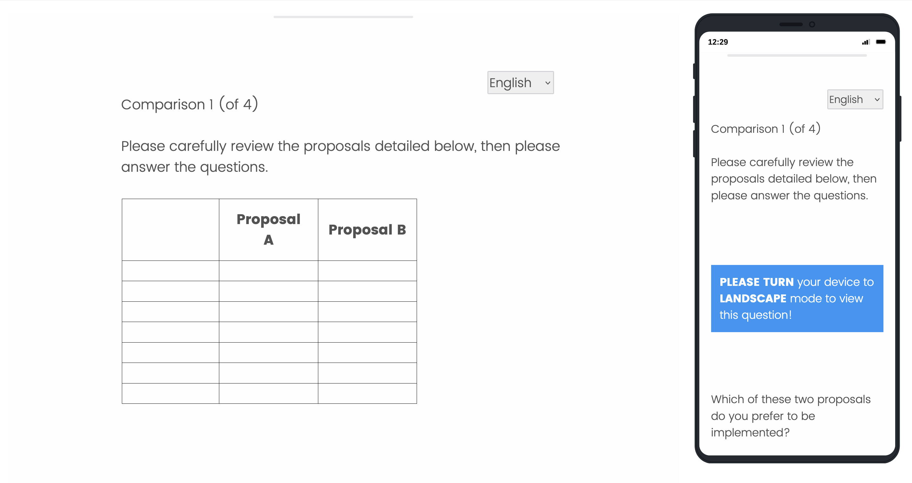

# Tiny Conjoint Helpers for Qualtrics

A collection of some helpers for performing conjoint choice experiments in qualtrics surveys.

## Tables must be viewed in Landscape on Mobile

To achieve that the conjoint tables have to be viewed in landscape format for respondents on mobile, as exemplified below:

1.  Define all conjoint tables as

    `<table class="UserTable">`

    as you can see in [HTML_Conjointtable.html](https://github.com/brueckmann/Tiny_Conjoint_Helpers_for_Qualtrics/blob/main/HTML_Conjointtable.html).

2.  In qualtrics, the *Look & Feel*, under *Style*, add a *Custom CSV* (as explained in the [Screenshot](https://github.com/brueckmann/Tiny_Conjoint_Helpers_for_Qualtrics/blob/main/Screenshot_how_to_add_css_in_qualtrics_look_and_feel.png "View Screenshot"))
and define the behavio(u)r of `UserTable`, as provided in [CSS_for_conjoint_tables.css](https://github.com/brueckmann/Tiny_Conjoint_Helpers_for_Qualtrics/blob/main/CSS_for_conjoint_tables.css).

    (So far, this was used with the qualtrics flat template, as you can see in the pictures above.)

## Mass embedd variables in qualtrics survey flow

For the conjoint tables, you want a lot of embedded variables in the survey flow.

The javascript [MassEmbeddVariablesQualtrics.js](https://github.com/brueckmann/Tiny_Conjoint_Helpers_for_Qualtrics/blob/main/MassEmbeddVariablesQualtrics) adds all embedded variables needed for a conjoint based on [conjointsdt](https://github.com/astrezhnev/conjointsdt) by [\@astrezhnev](https://github.com/astroboylrx) into the Qualtrics survey flow.

You only provide 3 inputs, the number of tasks (how many repetitions), number of profiles per task (often 2) and number of attributes used per task). The code is influenced and adapted from a [comment](https://github.com/astrezhnev/conjointsdt/issues/5#issue-2146142409) by [\@astroboylrx](https://github.com/astroboylrx).

Much of this code can also be adapted for other uploads of embedded data to the Qualtrics survey flow.

## Qualtrics-CSS-use-question-in-landscape-mode-GB

This [file](Qualtrics-CSS-use-question-in-landscape-mode-GB.html) contains css can be included in qualtrics conjoint table questions as html code to notify users that these questions should be viewed in landscape view on mobile devices. It supports multiple languages, therefore, make sure to also include the code in all the translations.
